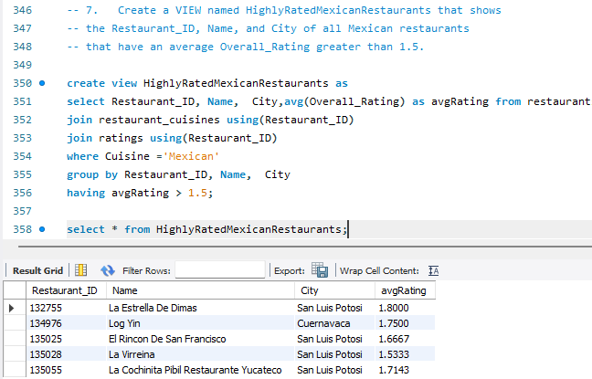

# Restaurant & Consumer Data Analysis Using SQL

## Project Overview

This project analyzes restaurant, consumer, cuisine preference, and customer rating data using SQL.

The objective is to understand consumer behavior, cuisine preferences, restaurant performance, and customer satisfaction. The analysis simulates a restaurant recommendation and business-insights use case.

## Business Problem

A restaurant discovery or recommendation platform needs to understand:

- Which restaurants receive high customer ratings?
- Which cuisines are preferred by different customer groups?
- How do consumer demographics, budget, and lifestyle affect restaurant preferences?
- Which restaurants have lower food or service ratings?
- How can customer and restaurant data support personalized recommendations?

## Dataset

The dataset contains information about consumers, restaurants, cuisine preferences, restaurant cuisines, and customer ratings.

### Tables Used

| Table | Description | Key Column |
|---|---|---|
| consumers | Consumer demographic and lifestyle information | Consumer_ID |
| consumer_preferences | Cuisine preferences for each consumer | Consumer_ID |
| restaurants | Restaurant details such as location, price, parking, and alcohol service | Restaurant_ID |
| restaurant_cuisines | Cuisines served by restaurants | Restaurant_ID |
| ratings | Consumer ratings for restaurants | Consumer_ID, Restaurant_ID |

## Database Relationships

- One consumer can have multiple cuisine preferences.
- One restaurant can serve multiple cuisines.
- One consumer can rate multiple restaurants.
- One restaurant can be rated by multiple consumers.
- The ratings table connects consumers and restaurants.

## SQL Concepts Used

- SELECT and WHERE clause
- AND and OR conditions
- INNER JOIN
- Subqueries
- Aggregate functions: COUNT, AVG
- GROUP BY and HAVING
- Common Table Expressions (CTEs)
- Derived tables
- Window functions: RANK, ROW_NUMBER, LAG
- Views
- Stored procedures
- CASE statements

## Key Analysis Questions

- Identify consumers living in specific cities.
- Find student consumers who smoke or have a low budget.
- Identify restaurants based on price, alcohol service, franchise status, and parking.
- Find highly rated restaurants and restaurants with below-average food ratings.
- Analyze consumers who rate restaurants in specific cities.
- Identify top restaurant ratings within each cuisine category.
- Find the top three cuisine preferences of low-budget students.
- Create reusable views for highly rated Mexican restaurants.
- Create stored procedures for restaurant-rating and consumer-segment analysis.

## Query: San Luis Potosi consumers who rated Mexican restaurants with rating 2

## Query: Rank ratings within each Cuernavaca restaurant

## Query: Top 3 preferred cuisines for low-budget students

## View: HighlyRatedMexicanRestaurants

Stored Procedure: GetRestaurantRatingsAboveThreshold

## Key Insights

- SQL queries can identify highly rated restaurants using Overall_Rating, Food_Rating, and Service_Rating.
- Consumer preferences can be analyzed using demographic details such as age, occupation, budget, city, and lifestyle.
- Low-budget students can be segmented for affordable cuisine-based restaurant recommendations.
- Restaurant performance can be compared using customer ratings and average rating measures.
- Views and stored procedures make the analysis reusable for reporting and recommendation use cases.

## Tools Used

- MySQL
- MySQL Workbench
- SQL
- CSV datasets
- Microsoft PowerPoint

## Project Files

- `sql/restaurant_consumer_analysis.sql` — SQL queries for the complete project
- `presentation/` — SQL project presentation
- `screenshots/` — ER diagram and sample query outputs
- `dataset/` — Source CSV files, if included

## Author

Jaanavi Velishoju
## Contact

- LinkedIn:https://www.linkedin.com/in/jaanavi-velishoju-ba7864376
- GitHub: http://github.com/JaanaviVelishoju
